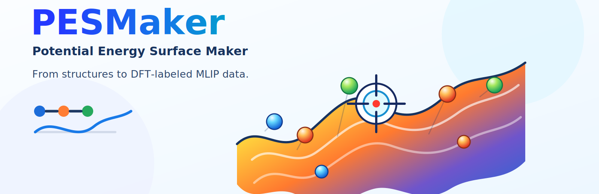

# PESMaker

PESMaker, short for **Potential Energy Surface Maker**, is a lightweight
workflow package for building application-oriented datasets for
machine-learned interatomic potentials from user-provided atomistic
structures.

It is designed for practical materials workflows where you already have
meaningful structures, such as bulk phases, surfaces, defects, interfaces, or
reaction candidates, and need to turn them into reproducible DFT labeling jobs
and training inputs.

## Why PESMaker

PESMaker helps you move from structures to MLIP training data without turning
the workflow into one large hidden script:

- generate supercells, surface slabs, vacancies, line defects, and optional
  perturbed structures from CIF, POSCAR, XYZ, and other ASE-readable inputs;
- keep every generated structure traceable through `manifest.jsonl` and
  human-readable summaries;
- prepare VASP SCF folders with `POSCAR`, `INCAR`, optional `POTCAR`, and
  `submit.sh`;
- submit prepared jobs through machine-specific Slurm templates;
- collect completed SCF outputs into an extxyz training set;
- prepare NEP training folders while keeping sampling, labeling, collection,
  and training as separate inspectable stages.

PESMaker is user-structure-driven rather than random-search-first. The intended
use case is targeted dataset construction for batteries, solid electrolytes,
thermal transport, alloys, 2D materials, defects, surfaces, catalysis, and
reactions.

## Installation

```bash
git clone https://github.com/Tingliangstu/PESMaker.git
cd PESMaker
python -m pip install .
pesmaker --help
```

No internet: copy or unzip the PESMaker source folder, then run the last two
commands inside it.

## Updating an Existing Checkout

If you are already inside the PESMaker repository on `main`:

```bash
git pull --ff-only
python -m pip install .
```

If you are not sure where you are:

```bash
cd ~/software/PESMaker
git switch main
git pull --ff-only
python -m pip install .
```

No internet: copy or unzip a newer PESMaker source folder, then reinstall:

```bash
cd /path/to/PESMaker
python -m pip install .
```

## Workflow

For most runs, validate the YAML and then let `next` advance the workflow until
it reaches a submit preview, waits for external results, or finishes the local
steps:

```bash
pesmaker validate run.yaml
pesmaker next run.yaml
```

You do not need to write a workflow name. PESMaker infers the flow from the
YAML sections and existing artifacts. For example, a config with
`sampling.engine` and `sampling.selection` will prepare sampling, wait for MD
trajectories, select frames, then continue to SCF and training if those
sections are configured.

`next` never submits jobs for real. At a sampling, SCF, or training submit
boundary it writes a dry-run log, records the gate in
`.pesmaker/<project>/next_state.json`, and prints the command to submit
manually.

Manual direct generation and DFT labeling:

```bash
pesmaker generate run.yaml
pesmaker scf-setup run.yaml
pesmaker submit run.yaml --dry-run
pesmaker submit run.yaml
pesmaker collect run.yaml
```

Manual sampling, labeling, and training loop:

```bash
pesmaker generate run.yaml
pesmaker sample-setup run.yaml
pesmaker submit run.yaml --stage sampling
pesmaker select run.yaml
pesmaker scf-setup run.yaml
pesmaker submit run.yaml
pesmaker collect run.yaml
pesmaker train-setup run.yaml
pesmaker submit run.yaml --stage training
```

`submit` always submits `submit.sh` files prepared by an earlier setup command.
Without `--stage`, it submits the SCF labeling stage by default.

```text
generated/   # supercells, surfaces, defects, optional perturbations
sampling/    # GPUMD MD job folders and submit scripts
selected/    # representative frames selected from trajectories
labeling/    # VASP SCF calculation folders
train.xyz    # collected labeled dataset
training/    # NEP training input folder and submit script
```

## Examples

Minimal YAML examples are grouped by task type in the documentation:

See [`docs/examples/minimal-yaml.md`](docs/examples/minimal-yaml.md).

## Documentation

Start with [`docs/usage.md`](docs/usage.md). Command pages are under
[`docs/commands/`](docs/commands/), and minimal YAML examples are in
[`docs/examples/minimal-yaml.md`](docs/examples/minimal-yaml.md).

The intended GitHub Pages URL is:

```text
https://Tingliangstu.github.io/PESMaker/
```

## Current Scope

Current implemented stages cover structure generation, GPUMD sampling setup,
trajectory-frame selection, VASP SCF setup, scheduler submission, extxyz dataset
collection, and NEP training setup. Future backends such as LAMMPS-MACE can use
the same stage boundaries.

## License

PESMaker is free software distributed under the GNU General Public License,
version 3 of the License, or (at your option) any later version. See
[`LICENSE`](LICENSE) and [`NOTICE`](NOTICE) for details.
