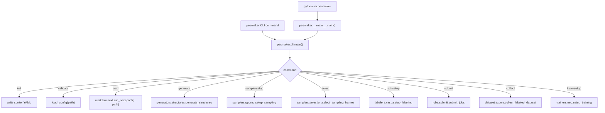
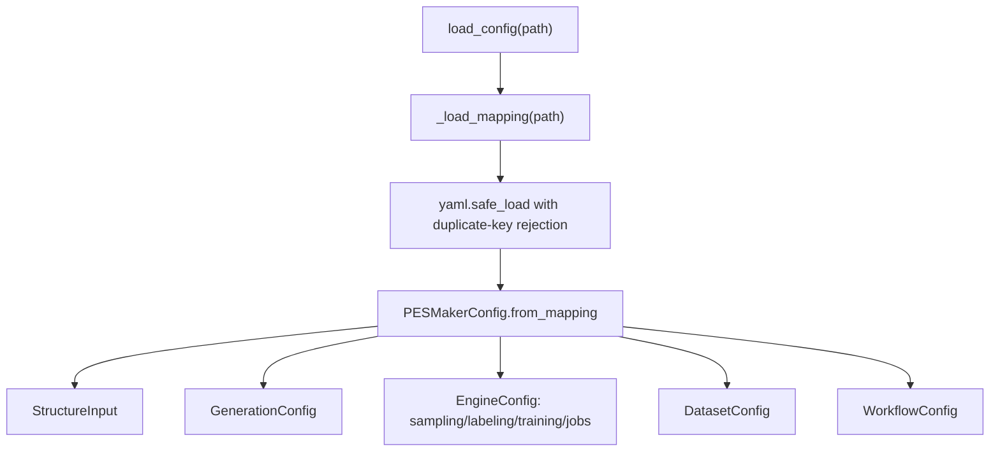
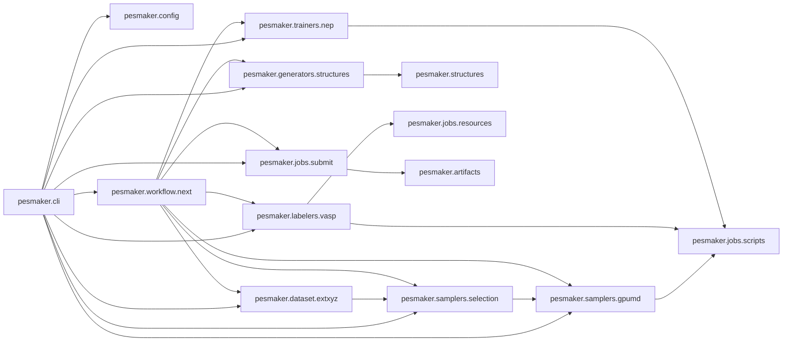
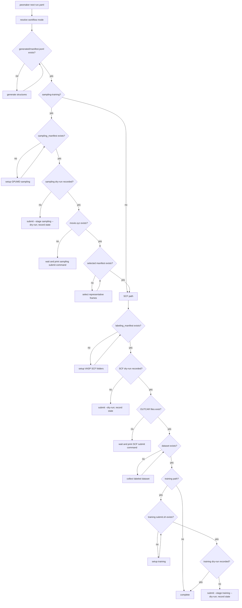

# PESMaker Code Logic

This document summarizes the current code flow after the stage split.

## Entry Points



## Config Flow



`WorkflowConfig.mode` accepts `auto`, `direct-scf`, and `sampling-training`.
`auto` resolves to `sampling-training` when sampling and selection are
configured; otherwise it resolves to `direct-scf`.

## Module Dependencies



## Smart Next Flow



## Compatibility

Older imports remain valid:

```python
from pesmaker.workflow.generate import generate_structures
from pesmaker.workflow.stages import submit_jobs, StageResult
```

Those modules re-export symbols from the domain packages.
