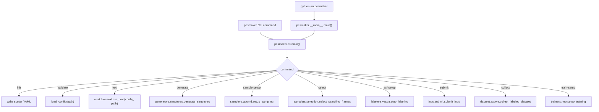
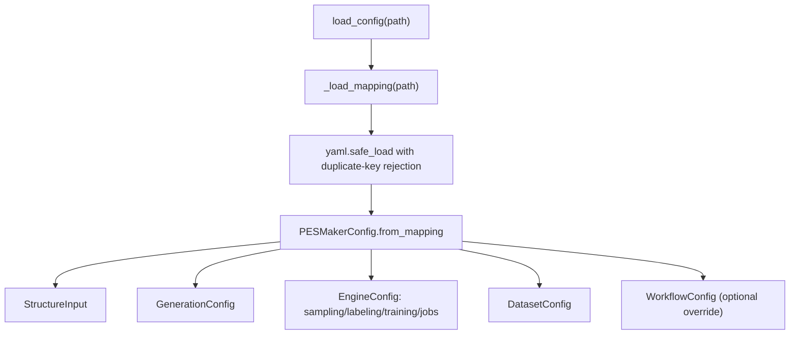
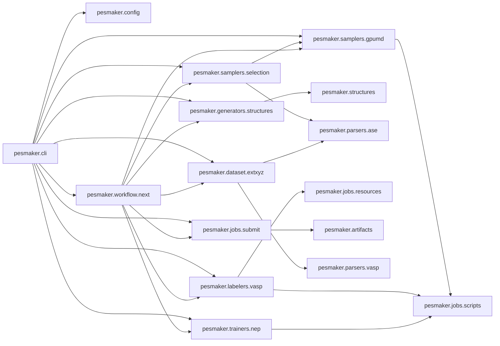
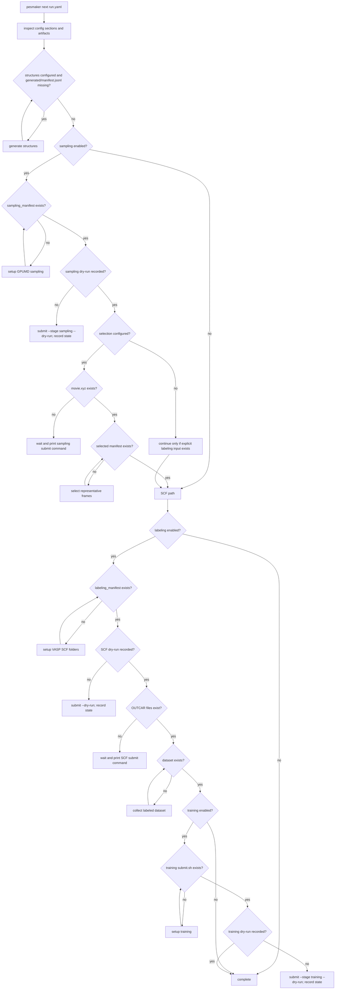

# PESMaker Code Logic

This document summarizes the current code flow after the stage split.

## Entry Points



## Config Flow



Normal user configs omit `workflow`. `pesmaker next` infers the flow from
configured sections and existing files. `WorkflowConfig.mode` still accepts
`auto`, `direct-scf`, and `sampling-training` for older configs and advanced
overrides; `direct-scf` forces `next` to skip sampling and training sections.

## Module Dependencies



## Smart Next Flow



## Compatibility

Older imports remain valid:

```python
from pesmaker.workflow.generate import generate_structures
from pesmaker.workflow.stages import submit_jobs, StageResult
```

Those modules re-export symbols from the domain packages.
