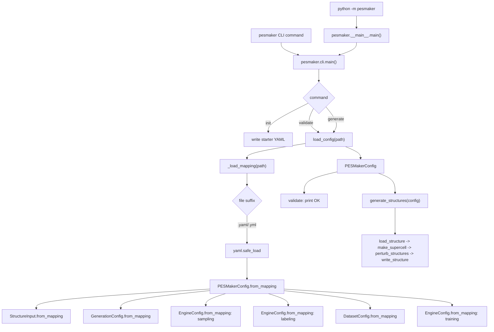
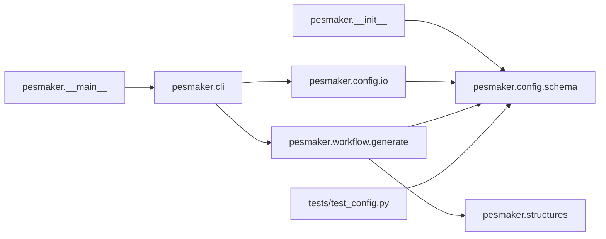
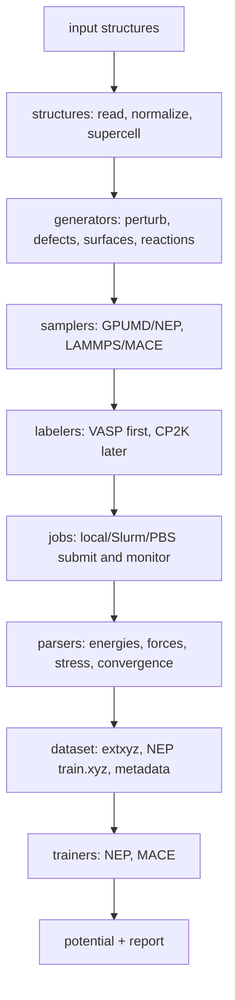

# PESMaker Code Logic

This document describes the current scaffold-level code flow. It should be
updated as real workflow stages are added.

## Current entry points

## Module dependencies

## Current responsibilities

- `pesmaker.cli`: command-line parsing and user-facing commands.
- `pesmaker.config.io`: YAML file loading.
- `pesmaker.config.schema`: typed configuration objects and validation.
- Empty stage packages: future homes for structures, samplers, generators,
  labelers, jobs, parsers, dataset assembly, and trainers.

## Intended stage flow

